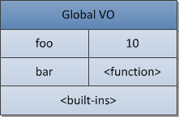
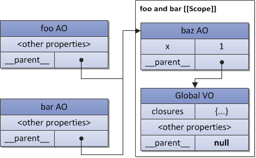

### 对象
> 对象是属性的集合，并有另一个对象或者 null 作为其`prototype` (原型), 由内部属性 `[[Prototype]]` 指向。
 
- `[[Prototype]]`是内部属性，在脚本中无法访问；在 Firefox, Safari, Chrome 的实现中，支持为 `__proto__`，默认指向构造函数的 `prototype` 对象
- ES6 标准化了 `__proto__` 属性，并且可以在对象初始化的时候使用它

---


### 原型链 (prototype chain)
> 原型对象也是简单对象，可以拥有自己的原型。以此递推，形成原型链。原型链终止于 `null`; 原型链是一个用来实现继承和共享属性的有限对象链

```js
// 构造函数
function Foo(y) {
  // 构造函数将会以特定模式创建对象：被创建的对象都会有"y"属性
  this.y = y;
}
// "Foo.prototype"存放了新建对象的原型引用
// 继承属性"x"
Foo.prototype.x = 10;
// 继承方法"calculate"
Foo.prototype.calculate = function (z) {
  return this.x + this.y + z;
};
// 使用Foo模式创建 "b" and "c"
var b = new Foo(20);
var c = new Foo(30);
// 调用继承的方法
b.calculate(30); // 60
c.calculate(40); // 80

console.log(
  b.__proto__ === Foo.prototype, // true
  c.__proto__ === Foo.prototype, // true
  // "Foo.prototype"自动创建了一个特殊的属性"constructor", 指向的构造函数本身
  // 实例"b"和"c"可以通过授权找到它并用以检测自己的构造函数
  b.constructor === Foo, // true
  c.constructor === Foo, // true
  Foo.prototype.constructor === Foo // true
  b.calculate === b.__proto__.calculate, // true
  b.__proto__.calculate === Foo.prototype.calculate // true
);
```

---
- 访问属性\方法：
  + 查找过程从当前对象开始，沿原型链逐级查找。找到第一个匹配项则停止查找，返回该值；若直至原型链末端仍无匹配项，返回 `undefined`
  + 赋值过程只在当前对象上查找，存在该属性\方法则更新，否则新建并赋值。
  
---

### 执行上下文栈
- 有三种类型的 ECMAScript 代码：全局代码、函数代码和 eval 代码。
- 每段代码都是在其对于的执行上下文中被执行。有且只有一个全局执行上下文，可能多个函数执行上下文和 eval 执行上下文。
- 当调用一个函数时，就进入了函数执行上下文，并运行函数内部的代码；当执行 eval 时，就进入 eval 的执行上下文，并运行 eval 中的代码。
- 一个函数可以创建无数个执行上下文，因为对函数的每次调用（即便是该函数递归调用自己）都将生成一个具有新状态的上下文。
> 
```js
function foo(bar) {}
// call the same function, generate three different
// contexts in each call, with
// different context state (e.g. value of the "bar" argument)
foo(10);
foo(20);
foo(30);
```

激活其他上下文的上下文被称为调用者（caller），被激活的上下文称为被调用者（callee）

当一个 caller 激活了一个 callee，那么这个 caller 就会暂停它自身的执行，然后将控制权交给这个 callee。这个 callee 被压入栈中，并成为一个运行中（活动的）执行上下文。在 callee 的上下文结束后，它会把控制权返回给 caller，然后 caller 的上下文继续执行（它可能触发其他上下文）直到它结束，以此类推。一个 callee 可以简单的返回或抛出一个异常来结束自身的上下文，一个抛出而未被捕获的异常可以退出（出栈）一个或多个执行上下文。

程序开始运行时就进入额全局执行上下文，全局上下文位于栈底，而且是栈的第一个元素。然后，全局代码开始初始化，创建一些需要的对象或函数。当在全局上下文中运行时，其中的代码可能调用其他函数（已经创建），此时就会进入这个函数的上下文，向栈中压入新的元素，依次类推。当初始化完成后，运行时系统（runtime system）就会等待一些事件（比如鼠标点击事件），这些事件将触发一些函数，从而进入新的执行山下文。


---

### 执行上下文
一个执行上下文可以抽象为一个简单的对象来表示，每个执行上下文拥有一系列属性（也可以称作上下文状态）来跟踪其代码的执行过程，下图展示了一个上下文的结构：


---

### 变量对象(VO)

- 变量对象是执行上下文的数据容器，它是一个与执行上下文相关的特殊对象，储存了在执行上下文中定义的变量和函数声明
- 函数表达式（与函数声明相对）不包含在变量对象中
- 变量对象是一个抽象概念，在不同的执行上下文中，变量对象在结构上表现为不同的对象。例如，在全局上下文中，变量对象就是全局对象自身（这就是为什么我们可以通过全局对象的属性名来访问全局变量）

```js
var foo = 10;
function bar() {} // // 函数声明
(function baz() {}); // 函数表达式
console.log(
  this.foo == foo, // true
  window.bar == bar // true
);
console.log(baz); // 引用错误，baz没有被定义
```


---

### 活动对象(AO)
当一个函数被调用时，一个称为活动对象（activation object）的特殊对象将被创建。活动对象包含形参和特殊的 `arguments`对象（具有索引属性的参数映射）。在函数上下文中，活动对象作为变量对象来使用

也就是说，一个函数的变量对象仍然是一个简单的对象，除了储存变量和函数声明外，它还储存了函数的形参以及 `arguments` 对象，并被称为活动对象。
```js
function foo(x, y) {
  var z = 30;
  function bar() {} // 函数声明
  (function baz() {}); // 函数表达式
}
foo(10, 20);
```


---

### 作用域链
> 作用域链是一个对象列表，上下文代码中出现的标识符将在这个列表中查找。

- 与原型链相似，查找规则也很简单：如果一个变量在函数自身作用域（在函数自身的变量/活动对象）中没有找到，那么就会查找父级函数（外层函数）的变量对象，以次类推。
- 就上下文而言，标识符指：变量名称、函数声明、形参，等等。当一个函数在其代码中引用的标识符不是本地变量（函数或形参），那么这个标识符就称为自由变量，查找这些自由变量时就需要用到作用域链。
- 当解析（查找）一个标识符的时候，会从作用域链中的活动对象开始查找，然后（如果这个标识符在函数自身的活动对象中没有被查找到）向作用域链的上一层查找 － 重复这个过程，就和原型链一样。

---

### 闭包
> 闭包是一个代码块（在 ECMAScript 是一个函数）和以静态方式/词法方式进行存储的所有父作用域的一个集合体。所以，通过这些存储的作用域，函数可以很容易的找到自由变量。
> ECMAScript 完全支持闭包，技术上是通过函数的 [[Scope]] 属性实现的,

**内部函数在被创建的时候会在它的 [[Scope]] 属性中保存父函数的作用域链。所以当函数被调用的时候，它上下文的作用域链会被格式化成活动对象与 [[Scope]] 属性的和（实际上就是我们刚刚在上图中所看到的**
```js
Scope chain = Activation object + [[Scope]]
作用域链 = 活动对象 + [[Scope]]
```

*函数在被创建时保存外部作用域，是因为这个被保存的作用域链将会在未来的函数调用中用于变量查找,这种形式的作用域称为静态作用域（词法作用域）*
```js
// 全局变量 "x"
var x = 10;
// 全局function
function foo() {
  console.log(x);
}
(function (funArg) {
// 局部变量 "x"
var x = 20;
// 这不会有歧义
// 因为我们使用"foo"函数的[[Scope]]里保存的全局变量"x",
// 并不是caller作用域的"x"
  funArg(); // 10, 而不是20
})(foo); // 将foo作为一个"funarg"传递下去
```

- 由于每个（标准的）函数都在创建的时候保存了 [[Scope]]，所以理论上来讲，ECMAScript 中的所有函数都是闭包。
- 另一个需要注意的重要事情是，多个函数可能拥有相同的父作用域（这是很常见的情况，比如当我们拥有两个内部/全局函数的时候）。在这种情况下，[[Scope]] 属性中存储的变量是在拥有相同父作用域链的所有函数之间共享的。一个闭包对变量进行的修改会体现在另一个闭包对这些变量的读取上
> 
```js
function baz() {
    var x = 1;
    return {
      foo: function foo() { return ++x; },
      bar: function bar() { return --x; }
    };
}
var closures = baz();
console.log(
    closures.foo(), // 2
    closures.bar()  // 1
);
```
 (这里 `__parent__` 只是概念上的表示)
这个特性在循环中创建多个函数的时候会使人非常困惑。在创建的函数中使用循环计数器的时候，一些程序员经常会得到非预期的结果，所有函数中的计数器都是同样的值。－- 因为所有这些函数拥有同一个 [[Scope]]，这个属性中的循环计数器的值是最后一次所赋的值。

---

### this
> this 是执行上下文的一个属性，而不是变量对象的属性。
> **与变量相反，this 从不会参与到标识符解析过程。换句话说，在代码中当访问 this 的时候，它的值是直接从执行上下文中获取的，并不需要任何作用域链查找。this 的值只在进入上下文的时候进行一次确定**

这个 this 值是通过函数调用表达式（也就是函数被调用的方式）的形式由 caller 所提供的,详细的解释见 [this](this.html)
```js
// 函数 foo 的代码从未改变，但是 this 的值在每次调用时都不一样
function foo() {
    alert(this);
}
// caller 激活 "foo" (callee) 并为 callee 提供 this 的值
foo(); // 全局对象
foo.prototype.constructor(); // foo.prototype
var bar = {
    baz: foo
};
bar.baz(); // bar
(bar.baz)(); // also bar
(bar.baz = bar.baz)(); // but here is global object
(bar.baz, bar.baz)();  // also global object
(false || bar.baz)();  // also global object
var otherFoo = bar.baz;
otherFoo(); // again global object
```
